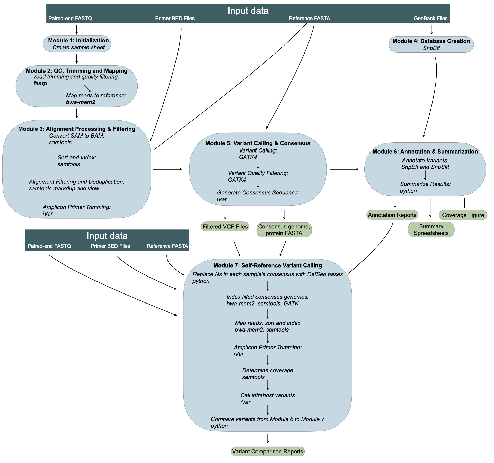

# Virus Variant Calling Pipeline

This pipeline processes paired-end FASTQ files to perform variant calling and generate consensus sequences for viral genomes, specifically designed for Dengue virus (DENV1-3). It uses a series of bioinformatics tools to map reads, convert SAM to BAM, call variants, annotate them with SnpEff, and summarize results.



## Table of Contents
- [Overview](#overview)
- [Prerequisites](#prerequisites)
- [Installation](#installation)
- [Usage](#usage)
- [Directory Structure](#directory-structure)
- [Troubleshooting](#troubleshooting)
- [License](#license)
- [Contact](#contact)

## Overview

The pipeline performs the following steps:
1. **Create Sample Sheet**: Generates a `samplesheet.tsv` from FASTQ files.
2. **Map Reads**: Trims reads with `fastp`, runs `FastQC`, and maps reads to a reference using `bwa-mem2`.
3. **SAM to BAM Conversion**: Converts SAM files to sorted and indexed BAM files using `samtools`.
4. **SnpEff Database Creation**: Builds a SnpEff database from a GenBank file.
5. **Variant Calling and Consensus**: Performs variant calling with `ivar` and `GATK`, generating consensus sequences.
6. **Summarization**: Summarizes coverage, consensus FASTA, and SnpEff annotations.

## Prerequisites

- **Operating System**: Linux (tested on Ubuntu) or macOS.
- **Conda**: Miniconda or Anaconda installed.
- **Input Files**:
  - Paired-end FASTQ files (e.g., `fastq/D1-1_S1_L001_R1_001.fastq.gz`, `fastq/D1-1_S1_L001_R2_001.fastq.gz`).
  - Reference FASTA file (e.g., `references/NC_001477.1.fasta`).
  - GenBank file for SnpEff (e.g., `NC_001477.1.gb`, downloadable from NCBI).

## Installation

1. **Clone the Repository**:
   ```bash
   git clone https://github.com/mihinduk/Virus-Variant-Calling-Pipeline-updated.git
   cd Virus-Variant-Calling-Pipeline-updated
   ```

2. **Set Up Conda Environment**:
   Create the `dengue_pipeline` environment using the provided `environment.yml`:
   ```bash
   conda env create -f environment.yml
   conda activate dengue_pipeline
   pip install -r requirements.txt
   pip install .
   ```
   If pip is not available, install it first:
   ```bash
   sudo apt-get install python3-pip
   ```

3. **Verify Tools**:
   Ensure all required tools are installed:
   ```bash
   which bwa-mem2 samtools fastp fastqc gatk snpeff snpsift ivar bcftools
   python --version  # Should output Python 3.11.x
   ```

4. **Download GenBank File (if not provided)**:
   The repository includes GenBank files for DENV1-3. To download additional ones:
   ```bash
   wget -O NC_001477.1.gb "https://eutils.ncbi.nlm.nih.gov/entrez/eutils/efetch.fcgi?db=nucleotide&id=NC_001477.1&rettype=gb&retmode=text"
   ```

## Usage

1. **Prepare Input Files**:
   - Place paired-end FASTQ files in a `fastq/` directory.
   - Ensure the reference FASTA and GenBank file are available (included in `references/` and repo root).

2. **Run the Pipeline** (example for DENV1):
   ```bash
   run_pipeline \
     --input_dir fastq/ \
     --reference_fasta references/NC_001477.1.fasta \
     --genbank_file NC_001477.1.gb \
     --output_dir output/ \
     --config configs/denv1.yaml
   ```

   **Optional arguments**:
   - `--primer_bed primers/your_primers.bed` — BED file with primer coordinates for ivar trim. If omitted, primer trimming is skipped.
   - `--sample_names "Sample1,Sample2"` — Comma-delimited custom sample names (must match the number of FASTQ pairs).
   - `--annotation_mode config` — Use lightweight config-based annotation instead of snpEff (does not require a GenBank file).

   **Example for DENV2**:
   ```bash
   run_pipeline \
     --input_dir fastq/ \
     --reference_fasta references/NC_001474.2.fasta \
     --genbank_file NC_001474.2.gb \
     --output_dir output_denv2/ \
     --config configs/denv2.yaml
   ```

3. **Output Files** (see `virus_pipeline/OUTPUT_DOCUMENTATION.md` for full details):
   - `output/samplesheet.tsv`: Sample sheet with FASTQ file paths.
   - `output/sam_files/*.sam`: SAM files from read mapping.
   - `output/*.sorted.bam`: Sorted and indexed BAM files.
   - `output/*.vcf`: Variant call files (raw, filtered, PASS, annotated).
   - `output/*_annotations.tsv`: Per-sample variant annotation tables.
   - `output/*_coverage.png`: Per-sample coverage plots.
   - `output/coverage_summary.xlsx`: Coverage metrics across all samples.
   - `output/merged_summary.xlsx`: Combined QC, coverage, and mapping summary.
   - `output/summary_table.csv`: SnpEff variant summary.
   - `output/provenance_report.txt`: Full pipeline provenance and parameters.

## Directory Structure

```
Virus-Variant-Calling-Pipeline-updated/
├── fastq/                    # Input FASTQ files (user-provided)
├── references/               # Reference FASTA files
│   ├── NC_001477.1.fasta     # DENV1
│   ├── NC_001474.2.fasta     # DENV2
│   └── NC_001475.2.fasta     # DENV3
├── configs/                  # Virus-specific configuration files
│   ├── denv1.yaml
│   ├── denv2.yaml
│   └── denv3.yaml
├── NC_001477.1.gb            # GenBank files for SnpEff
├── NC_001474.2.gb
├── NC_001475.2.gb
├── output/                   # Output directory (auto-created)
│   ├── sam_files/            # SAM files from map_reads.py
│   ├── *.sorted.bam          # Sorted BAM files
│   ├── *.vcf                 # Variant call files
│   ├── *_annotations.tsv     # Per-sample variant annotations
│   ├── *_coverage.png        # Coverage plots
│   ├── coverage_summary.xlsx # Coverage summary across samples
│   ├── merged_summary.xlsx   # Combined QC/coverage/mapping summary
│   ├── summary_table.csv     # SnpEff variant summary
│   ├── provenance_report.txt # Pipeline provenance report
│   └── provenance.json       # Machine-readable provenance
├── virus_pipeline/           # Pipeline scripts
│   ├── create_samplesheet.py
│   ├── map_reads.py
│   ├── samtobamdenv.py
│   ├── create_snpeff_database.py
│   ├── variant_calling_consensus.py
│   ├── extract_proteins.py
│   ├── summarize_result.py
│   ├── summarize_snpEff.py
│   ├── summarize_annotations.py
│   ├── annotate_from_config.py
│   ├── config.py
│   ├── provenance.py
│   └── OUTPUT_DOCUMENTATION.md
├── environment.yml           # Conda environment file
├── requirements.txt          # Python pip dependencies
├── setup.py                  # Package installation
├── conda-recipe/             # Conda package recipe
│   └── meta.yaml
└── run_pipeline.py           # Main pipeline entry point
```

## Troubleshooting

- **No BAM Files in `output/`**:
  - Check if SAM files exist in `output/sam_files/`:
    ```bash
    ls -l output/sam_files/
    ```
  - Run `map_reads.py` manually to verify SAM file generation:
    ```bash
    python virus_pipeline/map_reads.py --samplesheet output/samplesheet.tsv --reference references/NC_001477.1.fasta --config configs/denv1.yaml
    ```
  - Ensure `samtobamdenv.py` finds SAM files:
    ```bash
    python virus_pipeline/samtobamdenv.py --input_dir output/sam_files --reference_fasta references/NC_001477.1.fasta --output_dir output --config configs/denv1.yaml
    ```

- **SnpEff Database Errors**:
  - Verify the GenBank file (e.g., `NC_001477.1.gb`) is valid and matches the reference FASTA.
  - Check SnpEff logs in `output/snpEff.config`.

- **Dependency Issues**:
  - Ensure Conda channels are configured:
    ```bash
    conda config --add channels defaults
    conda config --add channels conda-forge
    conda config --add channels bioconda
    conda config --set channel_priority strict
    ```
  - Recreate the environment if needed:
    ```bash
    conda env remove -n dengue_pipeline
    conda env create -f environment.yml
    ```

- **File Permission Issues**:
  ```bash
  chmod -R u+rwX output/
  ```

## License

This project is licensed under the MIT License. See the [LICENSE](LICENSE) file for details.

## Contact

For issues or questions, please contact the maintainer at:
- GitHub: [Rajindra04](https://github.com/Rajindra04)
- Email: [Add your email or preferred contact method]
